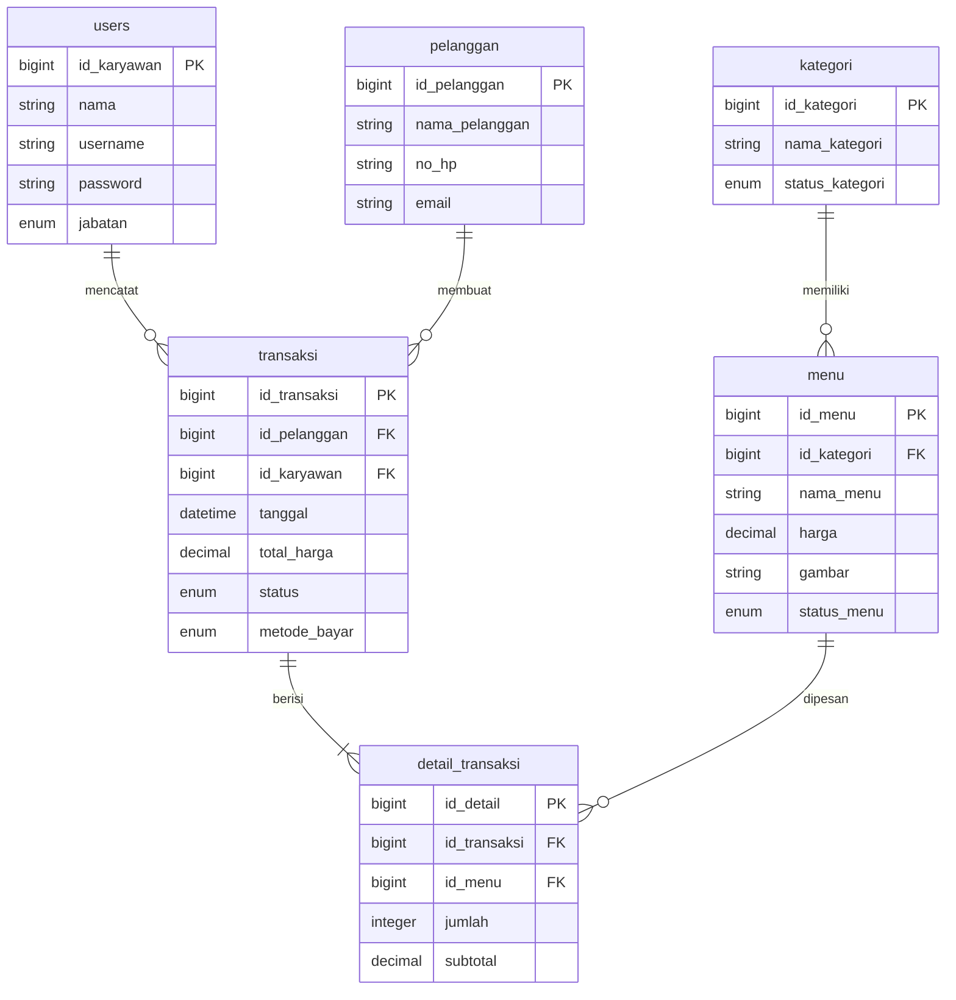

# Skema Basis Data HistoryKedai

Dokumen ini menjelaskan struktur tabel dan relasi pada database HistoryKedai.

```mermaid
erDiagram
    users ||--o{ transaksi : "mencatat"
    pelanggan ||--o{ transaksi : "membuat"
    kategori ||--o{ menu : "memiliki"
    transaksi ||--|{ detail_transaksi : "berisi"
    menu ||--o{ detail_transaksi : "dipesan"

    users {
        bigint id_karyawan PK
        string nama
        string username
        string password
        enum jabatan
    }

    kategori {
        bigint id_kategori PK
        string nama_kategori
        enum status_kategori
    }

    menu {
        bigint id_menu PK
        bigint id_kategori FK
        string nama_menu
        decimal harga
        string gambar
        enum status_menu
    }

    pelanggan {
        bigint id_pelanggan PK
        string nama_pelanggan
        string no_hp
        string email
    }

    transaksi {
        bigint id_transaksi PK
        bigint id_pelanggan FK
        bigint id_karyawan FK
        datetime tanggal
        decimal total_harga
        enum status
        enum metode_bayar
    }

    detail_transaksi {
        bigint id_detail PK
        bigint id_transaksi FK
        bigint id_menu FK
        integer jumlah
        decimal subtotal
    }
```
